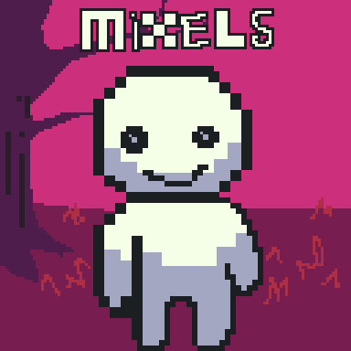

**What are Mixels?**
"Mixels" occur when an artist uses more than one consistent pixel size within one canvas. They are generally frowned upon in pixel art, as they tend to give a sense of being **amateurish, unintentional, visually displeasing**, and nowadays **reminiscent of AI**.

Beginner pixel artists will often resort to mixels as an attempt to circumvent the restrictions of their sprite size due to inexperience. It may also be an error when assembling multiple assets.

Artists using mixels intentionally should be aware of their effect on an artwork and viewer. Sensible usecases, however, are rare.
